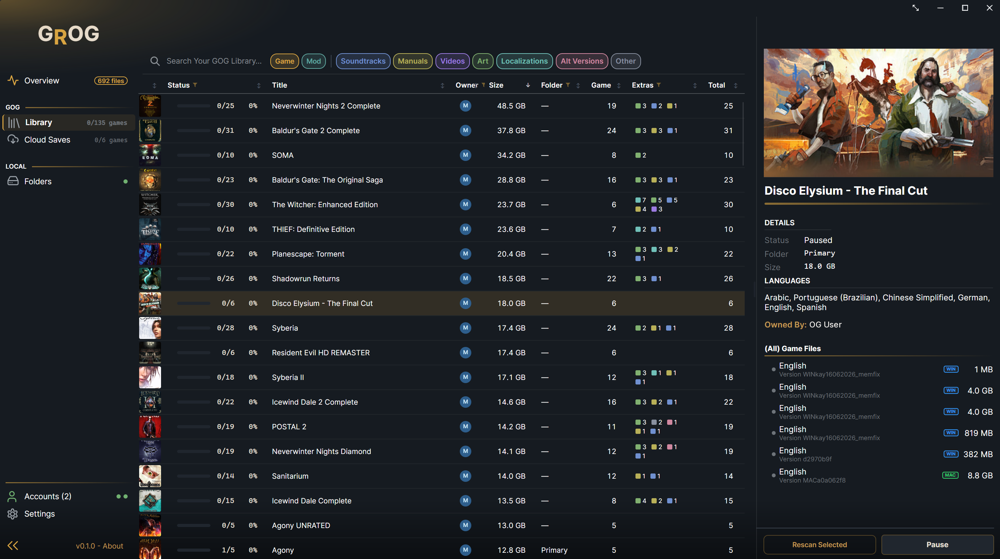

<div align="center">

<picture>
  <source media="(prefers-color-scheme: light)" srcset="docs/wordmark-light.png">
  
</picture>

[](../../releases/latest)
[](LICENSE)
[](#install)
[](https://avaloniaui.net)

**[Install](#install)** · **[Features](#features)** · **[FAQ](docs/FAQ.md)** · **[Command line](docs/CLI.md)** · **[Contributing](CONTRIBUTING.md)**

</div>

Grog backs up your entire GOG\* library - **Installers**, **Extras**, and **Cloud Saves** - to your own
drives, verified against GOG's checksums. One dashboard shows what you have, what's missing, and what's out
of date. DRM-free games are only truly yours once they're on your disk.

> Grog started as an experiment in how far today's agentic AI (Claude chat
> sessions and Cowork) could carry a real project, and it grew from there.
> I learned a lot along the way, and I hope you find it useful.



## Install

Download from the [latest release](../../releases/latest). Each guide covers install, updating, the
command-line tool, uninstalling and troubleshooting.

| Platform | Download | Guide |
|---|---|---|
| **Windows** 10 / 11 (x64) | `Grog-win-x64-setup.exe` (no admin needed), or `Grog-win-x64.zip` to run portable | [Windows](docs/install/Windows.md) |
| **macOS** 14+ (Apple Silicon or Intel) | `Grog-macos-arm64.dmg` / `Grog-macos-x64.dmg` | [macOS](docs/install/macOS.md) · [build from source](docs/install/macOS-source.md) |
| **Linux** (x64) | `Grog-linux-x64.tar.gz`, self-contained | [Linux](docs/install/Linux.md) |

Grog isn't signed yet, so Windows and macOS ask you to confirm the first launch; the guides show how.

## Features

**Back up everything you own**
- **Back Up Now** queues everything missing or out of date: installers, extras, DLC and cloud saves.
- **Checksums:** installers are verified against GOG's MD5s, so a bad download is caught at once.
- **Library dashboard:** status per file, per game and for the whole library; sortable and filterable.
- **Import** a folder of installers you already have; Grog adopts what it recognizes.

**Keeps it safe**
- **Fix Now** and **Try Again** re-download what went missing, got damaged or failed.
- **At-risk flags** mark games GOG no longer sells, so you guard those backups.
- **Runs on a schedule**, in the tray; the icon changes color if a run needs you.

**Works your way**
- **Installed or portable:** a no-admin installer, or a folder that runs from anywhere, USB stick included.
- **Several drives:** spread the library across drives; a disconnected drive pauses the backup until it's back.
- **Several GOG accounts in one library;** shared purchases appear once.
- **Extras** with each game or in their own folder tree; ratings, languages and an optional mature-content filter.
- **Command-line tool** for servers and scheduled jobs.

## Be aware of

- **Unsigned:** the first launch needs a confirmation (see the install guides). Windows 11's **Smart App
  Control**, when on, blocks Grog entirely.
- **Google, Steam, Discord or Xbox sign-in:** the first time, GOG asks for your GOG password to link the
  accounts. No GOG password yet? Use "Password reset" on the login page first.
- **A personal project:** support and updates happen as free time allows.

## Trust and security

- **Open source** (GPL-3.0-or-later). **No telemetry:** Grog talks only to GOG, and to GitHub to check for updates.
- **Your password never touches Grog:** you sign in on GOG's own page, and tokens are encrypted on your machine.
- **Plain folders:** no proprietary container or database, and Grog never deletes a file unless you ask it to.

Details, and how to report a vulnerability: [SECURITY.md](SECURITY.md).

### Where your backups go

A folder you choose, browsable without Grog:

```
GOG_Library/
├── Games/
│   └── the_witcher_3_wild_hunt/        installers and patches
│       └── Extras/                     soundtracks, manuals, wallpapers
├── Cloud Saves/
│   └── the_witcher_3_wild_hunt/        save snapshots
└── Old Versions/                       superseded builds, if you keep them
```

Prefer extras in their own `Extras/` tree, sorted by game or by type, even on a second drive? One setting.

**Disclaimer:** I have made every good-faith effort to include nothing insecure, malicious, anti-privacy or destructive. That said: **use at your own risk**. I built Grog for my own library and share it with the communities that made it possible.

## Command line

`grogcli` ships with the app: `grogcli backup --silent` runs a whole scheduled backup. Nearly thirty
commands, with `--json` output and exit codes. See [docs/CLI.md](docs/CLI.md).

## Building from source

For development. Requires the .NET 10 SDK. (Installing on a Mac from source?
See [the macOS guide](docs/install/macOS-source.md).)

```
dotnet build Grog.slnx
dotnet run --project src/Grog.App              # GUI
dotnet run --project src/Grog.Cli -- --help    # command-line tool
```

<details>
<summary><b>Self-contained publish</b> - what the releases ship</summary>

```
# Windows
dotnet publish src/Grog.App -c Release -r win-x64   --self-contained \
  -p:PublishSingleFile=true -p:EnableCompressionInSingleFile=true

# Linux
dotnet publish src/Grog.App -c Release -r linux-x64 --self-contained \
  -p:PublishSingleFile=true -p:EnableCompressionInSingleFile=true
```

Don't enable trimming. Avalonia relies on reflection and a trimmed build will misbehave.

</details>

## Known issues and roadmap

The [latest release notes](../../releases/latest) carry the current known-issues list. On the roadmap: a Flatpak on Flathub and signed binaries.

If you hit a snag, [open an issue](../../issues).

## Contributing

Bug reports and PRs are welcome; see [CONTRIBUTING.md](CONTRIBUTING.md), or [open an issue](../../issues).

## Alternatives

Not what you're after? All of these are free:

| Project | What it is |
|---|---|
| [gogrepoc](https://github.com/Kalanyr/gogrepoc) | cross-platform Python script; the core backup job, no GUI |
| [lgogdownloader](https://github.com/Sude-/lgogdownloader) | mature CLI downloader for Linux |

## License

Copyright (C) 2026 Kevin G. Scott.

GPL-3.0-or-later. See [LICENSE](LICENSE).

## Acknowledgments

Grog exists because of these projects and people:

| Who | What Grog owes them |
|---|---|
| [GOG.com](https://www.gog.com) | the DRM-free store Grog backs up |
| [Unofficial GOG API docs](https://gogapidocs.readthedocs.io) ([Yepoleb](https://github.com/Yepoleb)) | the API reference |
| [gogrepoc](https://github.com/Kalanyr/gogrepoc) & [lgogdownloader](https://github.com/Sude-/lgogdownloader) | the browserless GOG sign-in process, and proof the job could be done |
| [Libation](https://github.com/rmcrackan/Libation) ([rmcrackan](https://github.com/rmcrackan), [Mbucari](https://github.com/Mbucari) and contributors) | the library-dashboard concept, the grid-with-artwork idea, and inspiration for the name |
| [Avalonia](https://avaloniaui.net) (MIT) | the cross-platform UI framework |
| [Material Design Icons](https://pictogrammers.com/library/mdi/) (Apache 2.0) | the content-type glyphs |
| [Inter](https://rsms.me/inter/) & [Cascadia Mono](https://github.com/microsoft/cascadia-code) (SIL OFL 1.1) | the typefaces |
| [Claude](https://claude.ai) (Anthropic) | co-developed the architecture, interface and much of the implementation |

Full license texts for everything shipped in the binary:
[THIRD-PARTY-NOTICES.txt](THIRD-PARTY-NOTICES.txt). And yes, the Monkey Island resonance is
intentional.

---

\* Grog is unofficial and not affiliated with, or endorsed by, GOG.com or its owners. It talks to the same API
endpoints GOG's own clients use, authenticated with your account - so if GOG changes their API,
Grog breaks until it's fixed.
